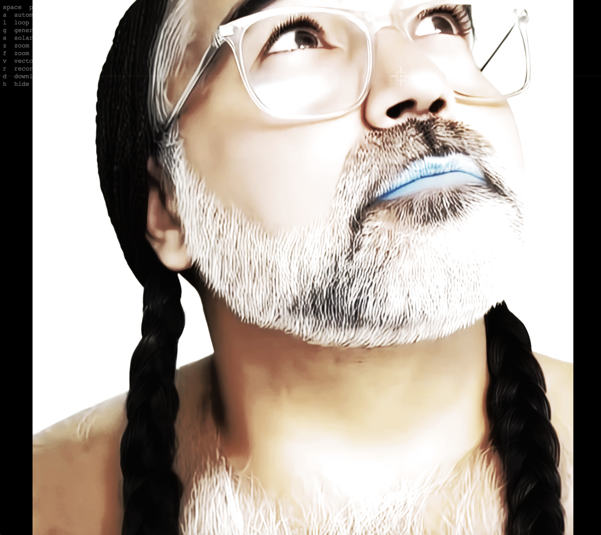

# Relentless Epistemic Acts



**Relentless Epistemic Acts** is an interactive visual piece—video and sound-reactive generative layers. Black-and-white techno vectors swarm across the frame; a crosshair replaces the system cursor.

## Live App

**[View Live →](https://marlonbarrios.github.io/relentless_epistemics_acts/)**

## Repository

**[github.com/marlonbarrios/relentless_epistemics_acts](https://github.com/marlonbarrios/relentless_epistemics_acts)**

```bash
git clone https://github.com/marlonbarrios/relentless_epistemics_acts.git
```

## Description

The video loads **paused** on the first frame. Press **Space** to play or pause. On-screen hints appear top-left; press **H** to hide them. There is no lyrics ticker.

You can perform the piece manually—toggling effects and zoom—or press **A** to let the app cycle through visual combinations on its own.

## Controls


| Key       | Action                                                                                            |
| --------- | ------------------------------------------------------------------------------------------------- |
| **Space** | Play / pause                                                                                      |
| **A**     | Toggle **automate** — random visual scenes driven by sound (overrides G, V, S, Z, F while active) |
| **G**     | Toggle **generative** video effects (RGB split, bloom, invert, drift, etc.)                       |
| **S**     | Toggle **solarize** — strong white solarization overlay                                           |
| **V**     | Toggle **vectors** — black-and-white techno swarm (grid, circuit links, waveforms, kick strobes)  |
| **Z**     | Zoom in (hold for slow drift)                                                                     |
| **F**     | Zoom out (hold for slow drift)                                                                    |
| **L**     | Toggle loop                                                                                       |
| **R**     | Start / stop canvas recording                                                                     |
| **D**     | Download recording as MP4 (WebM converted in-browser when needed)                                 |
| **H**     | Hide / show on-screen instructions                                                                |


## Manual Mode

When **automate** is off, each key controls one layer independently. Effects can be combined:

- **Generative (G)** — Color overlays on the video that pulse with bass, mids, and treble. Cycles through five variants on audio peaks and over time. Only renders while playing.
- **Solarize (S)** — A dedicated high-contrast white solarize pass, independent of generative mode. Works while paused or playing; intensity follows peaks when playing.
- **Vectors (V)** — A flocking swarm drawn as black-and-white techno graphics: dashed grid, scan beam, manhattan circuit links, square/triangle/cross nodes, saw/square waveform rails, radar rings, and kick-synced strobes. Density and motion follow song progress and audio. Works while paused (idle murmuration) or playing (audio-reactive).
- **Zoom (Z / F)** — Scales the video within the window (1× to 3.5×), centered and clipped to the frame. Smooth, slow movement when holding the keys.

While playing, active manual effects subtly respond to the music (brightness, density, intensity)—but only **you** decide which layers are on.

## Automate Mode (A)

Press **A** while playing to hand control to the system. It picks random combinations of generative, vectors, solarize, and zoom every **1–6 seconds**, so you see many different visual possibilities over time:

- Sometimes one effect alone, sometimes several at once, sometimes none
- Zoom often stays at full frame; when it changes, the move is a **very slow swim** in or out
- Sound can nudge choices (peaks → solarize, mids → vectors, energy → generative)
- Generative variant shuffles randomly during automate

Press **A** again to exit automate. Your previous manual settings (which effects were on and your zoom level) are restored.

## Cursor

The system cursor is hidden. A white techno **crosshair** follows the mouse, with faint full-frame guides and corner brackets.

## Recording

1. Press **R** to start recording the canvas (and video audio when available).
2. Press **R** again to stop.
3. Press **D** to download as `Relentless-Epistemic-Acts-…`. Chrome may save WebM first and convert to MP4 via ffmpeg.wasm.

## Technical Details

- **Stack:** p5.js, p5.sound, Web Audio API (`AnalyserNode` on the video element)
- **Video:** Loads paused at frame 0; scaled to window height, centered, aspect ratio preserved
- **UI:** Top-left control hints (toggle with H); custom crosshair cursor; no lyrics ticker
- **Generative:** 2D blend-mode overlays (no WebGL shader); five cycling variants
- **Vectors:** Swarm agents with alignment / cohesion / separation on a noise flow field (8-way quantized); black-and-white techno draw pass (grid, links, nodes, ornaments)
- **Solarize:** Multi-pass grayscale contrast / invert / screen stack
- **Zoom:** `videoZoom` lerps toward target; slower easing in automate mode
- **Automate:** Scene picker with weighted random combos; snapshot restores manual state on exit

## Local Development

1. Clone this repository:
  ```bash
   git clone https://github.com/marlonbarrios/relentless_epistemics_acts.git
   cd relentless_epistemics_acts
  ```
2. Serve the folder with a local web server (required for video and audio analysis — do not open as `file://`):
  ```bash
   python -m http.server 8000
  ```
3. Open `http://localhost:8000` in a browser

## Credits

- Concept & Development: Marlon Barrios Solano
- Technical implementation: p5.js

## License

MIT License

Copyright (c) 2024 Marlon Barrios Solano

Permission is hereby granted, free of charge, to any person obtaining a copy
of this software and associated documentation files (the "Software"), to deal
in the Software without restriction, including without limitation the rights
to use, copy, modify, merge, publish, distribute, sublicense, and/or sell
copies of the Software, and to permit persons to whom the Software is
furnished to do so, subject to the following conditions:

The above copyright notice and this permission notice shall be included in all
copies or substantial portions of the Software.

THE SOFTWARE IS PROVIDED "AS IS", WITHOUT WARRANTY OF ANY KIND, EXPRESS OR
IMPLIED, INCLUDING BUT NOT LIMITED TO THE WARRANTIES OF MERCHANTABILITY,
FITNESS FOR A PARTICULAR PURPOSE AND NONINFRINGEMENT. IN NO EVENT SHALL THE
AUTHORS OR COPYRIGHT HOLDERS BE LIABLE FOR ANY CLAIM, DAMAGES OR OTHER
LIABILITY, WHETHER IN AN ACTION OF CONTRACT, TORT OR OTHERWISE, ARISING FROM,
OUT OF OR IN CONNECTION WITH THE SOFTWARE OR THE USE OR OTHER DEALINGS IN THE
SOFTWARE.
